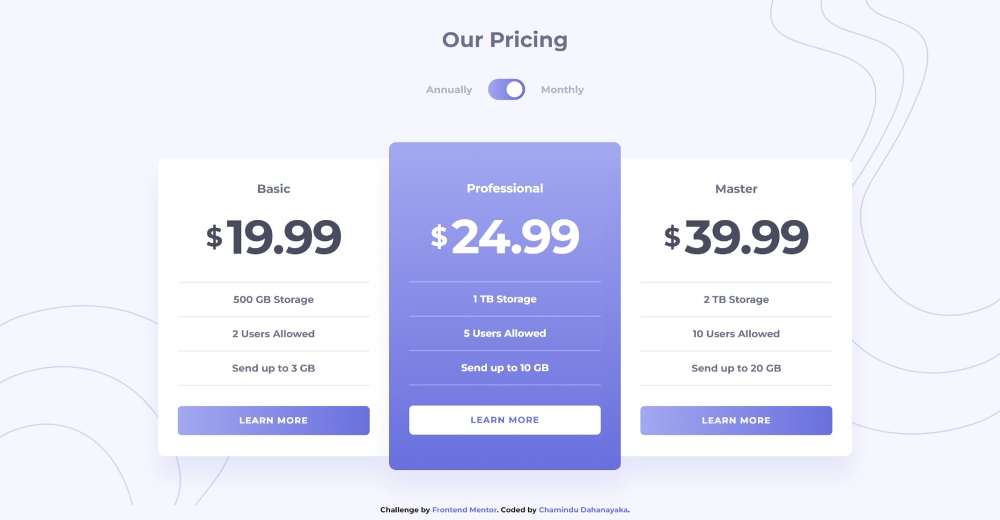

# Frontend Mentor - Pricing component with toggle solution

This is a solution to the [Pricing component with toggle challenge on Frontend Mentor](https://www.frontendmentor.io/challenges/pricing-component-with-toggle-8vPwRMIC). Frontend Mentor challenges help you improve your coding skills by building realistic projects. 

## Table of contents

- [Overview](#overview)
  - [The challenge](#the-challenge)
  - [Screenshot](#screenshot)
  - [Links](#links)
- [My process](#my-process)
  - [Built with](#built-with)
  - [What I learned](#what-i-learned)
  - [Continued development](#continued-development)
- [Author](#author)

## Overview

### The challenge

Users should be able to:

- View the optimal layout for the component depending on their device's screen size
- Control the toggle with both their mouse/trackpad and their keyboard
- **Bonus**: Complete the challenge with just HTML and CSS

### Screenshot



### Links

- Solution URL: [Add solution URL here](https://www.frontendmentor.io/solutions/responsive-pricing-component-with-toggle-using-mobilefirst-workflow-LQ87U8K38b)
- Live Site URL: [Add live site URL here](https://chamindud.github.io/Pricing-component-with-toggle/)

## My process

### Built with

- Semantic HTML5 markup
- Flexbox
- Mobile-first workflow

### What I learned

In this project, I learned to use below code snippets:

```html
<p class="monthly"><span>&dollar;</span>19.99</p>
```
```css
body::before{
    content: '';
    position: fixed;
    width: 100%;
    height: 100%;
    background-position: right top;
    pointer-events: none;
}
```
```js
document.addEventListener('keydown', (event) => {
  if(event.key === ' ' || event.key === 'Enter'){
      toggle.checked = !toggle.checked;
      selectPlan(); 
  }
});
    
function selectPlan(){
  if(toggle.checked){
      monthly.forEach(element => {
          element.style.display = 'none';
      });
      annually.forEach(element => {
          element.style.display = 'flex';
      });
  }else{
      monthly.forEach(element => {
          element.style.display = 'flex';
      });
      annually.forEach(element => {
          element.style.display = 'none';
      });
  }
}
```

### Continued development

I'm looking to improve my CSS & JavaScript knowledge to design more unique and new stuff.

## Author

- Frontend Mentor - [@ChaminduD](https://www.frontendmentor.io/profile/ChaminduD)
- LinkedIn - [Chamindu Dahanayaka](https://www.linkedin.com/in/chamindudahanayaka/)